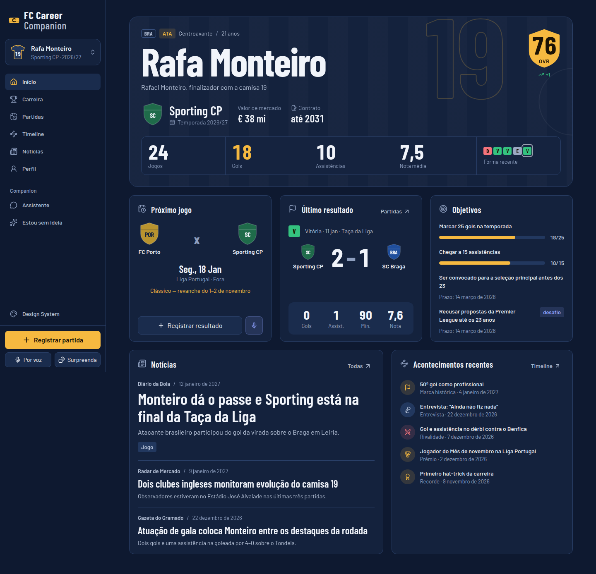
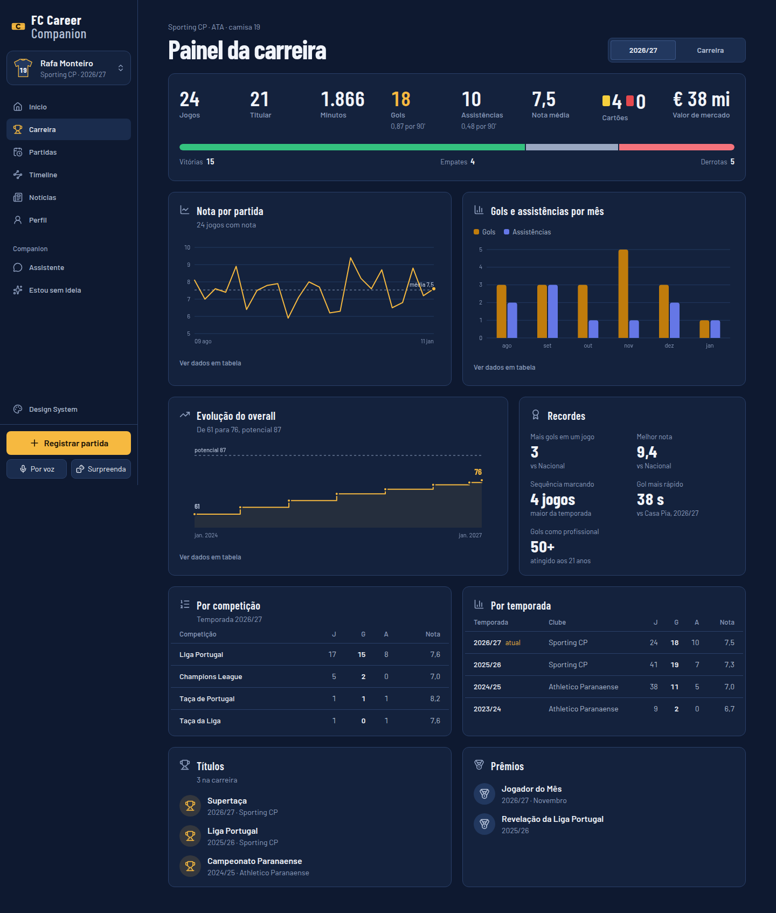
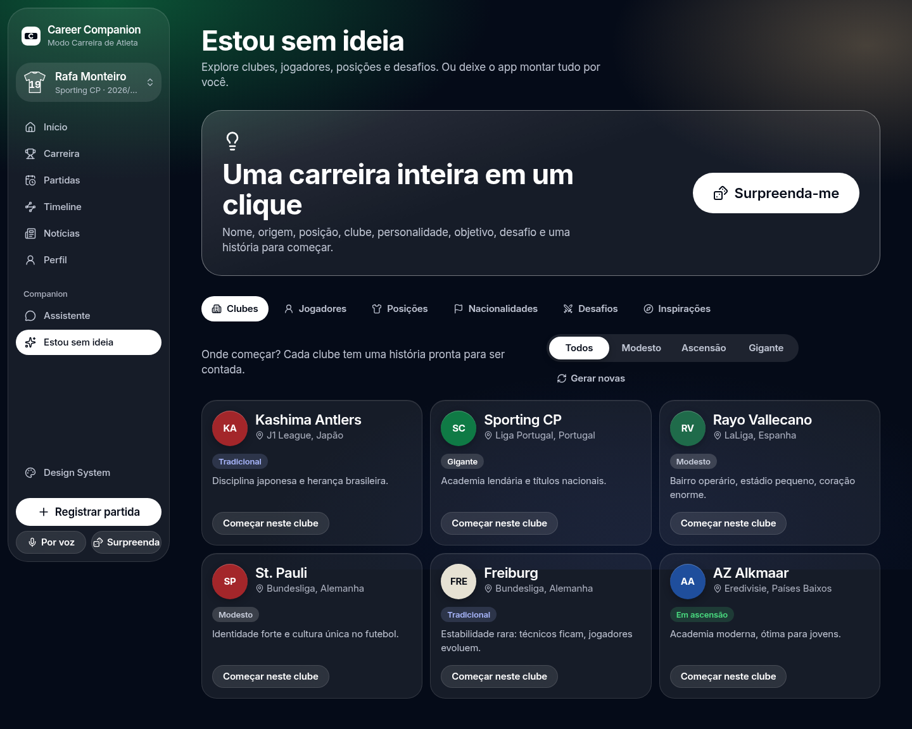
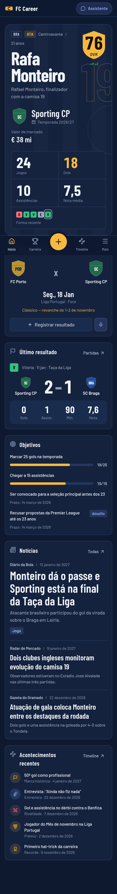
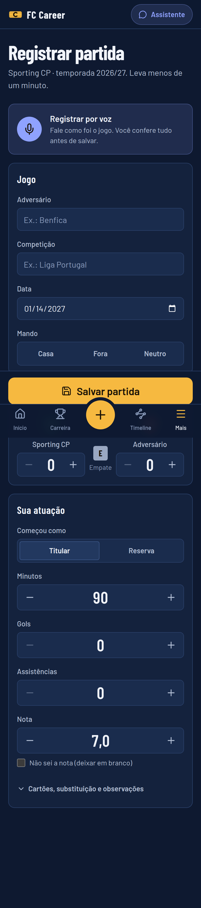
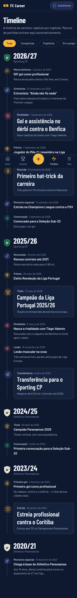

# FC Career Companion

> O companheiro do seu modo **Carreira de Atleta**. Registre partidas, acompanhe estatísticas e evolução, viva a carreira em uma timeline, leia as manchetes sobre você e converse com um assistente que conhece cada jogo.

O FC Career Companion faz o jogador sentir que acompanha uma carreira de futebol **viva** — não que preenche uma planilha. É uma mistura de modo carreira, diário esportivo, estatísticas, narrativa e um companion de IA.

> **Status: Fase 1 — protótipo navegável de alta fidelidade.** Todas as telas funcionam com dados mockados e persistência local no navegador. Backend, banco, agente de IA real e transcrição de áudio são as próximas fases (ver [Roadmap](#roadmap)).



<details>
<summary>Mais telas (painel, ideias, mobile)</summary>

| Painel da carreira                             | Estou sem ideia                               |
| ---------------------------------------------- | --------------------------------------------- |
|  |  |

| Home (mobile)                                    | Registrar partida (mobile)                               | Timeline (mobile)                                        |
| ------------------------------------------------ | -------------------------------------------------------- | -------------------------------------------------------- |
|  |  |  |

</details>

---

## Sumário

- [Funcionalidades](#funcionalidades)
- [Stack](#stack)
- [Arquitetura](#arquitetura)
- [Começando](#começando)
- [Scripts](#scripts)
- [Variáveis de ambiente](#variáveis-de-ambiente)
- [Banco de dados e migrations](#banco-de-dados-e-migrations)
- [Testes](#testes)
- [Build e deploy](#build-e-deploy)
- [CI/CD](#cicd)
- [Estrutura do projeto](#estrutura-do-projeto)
- [Design System](#design-system)
- [Fluxo de trabalho Git](#fluxo-de-trabalho-git)
- [O que ainda é mockado](#o-que-ainda-é-mockado)
- [Roadmap](#roadmap)
- [Aviso legal](#aviso-legal)

## Funcionalidades

| Tela               | Rota                      | O que faz                                                                                                                                                                                                                                                         |
| ------------------ | ------------------------- | ----------------------------------------------------------------------------------------------------------------------------------------------------------------------------------------------------------------------------------------------------------------- |
| Início             | `/`                       | Cartão do jogador (OVR, clube, temporada, valor), números da temporada, forma recente, próximo jogo, último resultado, objetivos, notícias e acontecimentos recentes                                                                                              |
| Painel da carreira | `/carreira`               | KPIs (jogos, titularidades, minutos, gols, assistências, nota, cartões, V/E/D), gráficos de nota por partida, gols/assistências por mês e evolução do overall, recortes por competição e por temporada, títulos, prêmios e recordes. Alterna temporada × carreira |
| Partidas           | `/partidas`               | Próximos jogos, lista da temporada agrupada por mês, filtros por competição e resultado                                                                                                                                                                           |
| Registrar partida  | `/partidas/nova`          | Registro rápido (steppers grandes, resultado ao vivo, validação por campo). Pré-preenchimento a partir da agenda. Tela de pós-jogo com marcos e notícia gerados                                                                                                   |
| Registrar por voz  | `/partidas/nova?modo=voz` | Gravar → transcrever → interpretar → prévia do que foi entendido e do que faltou → perguntas → aplicar ao formulário → confirmar. **Nada é salvo sem confirmação e nada é inventado**                                                                             |
| Timeline           | `/timeline`               | História da carreira em capítulos por temporada: estreia, gols, transferências, convocações, lesões, títulos, prêmios, recordes, rivalidades, entrevistas                                                                                                         |
| Notícias           | `/noticias`               | Manchetes fictícias da carreira e notícias geradas a partir das partidas                                                                                                                                                                                          |
| Assistente         | `/assistente`             | Chat com o companion (respostas simuladas, fundamentadas nos dados reais da carreira)                                                                                                                                                                             |
| Perfil             | `/jogador`                | Ficha completa, números da carreira, histórico de clubes, títulos, prêmios e recordes                                                                                                                                                                             |
| Nova carreira      | `/nova-carreira`          | Criador em 4 etapas (identidade, perfil em campo com seletor no campo, clube e nível, objetivo/desafio) com pré-visualização ao vivo                                                                                                                              |
| Estou sem ideia    | `/ideias`                 | Sugestões de clubes, jogadores, posições, nacionalidades, desafios e inspirações históricas, cada uma levando ao criador já preenchido                                                                                                                            |
| Surpreenda-me      | botão global              | Gera uma carreira completa (nome, nacionalidade, idade, posição, pé, altura, clube, arquétipo, personalidade, objetivo, desafio, história e inspiração) com revelação animada                                                                                     |
| Design System      | `/design-system`          | Catálogo vivo de tokens e componentes                                                                                                                                                                                                                             |

Outras características: múltiplas carreiras com troca rápida, restauração dos dados de demonstração, navegação mobile própria (barra inferior com ação central), estados de carregamento/vazio/erro/sucesso em todas as telas, `prefers-reduced-motion` respeitado.

## Stack

| Camada                       | Escolha                                                           | Por quê                                                                                                                    |
| ---------------------------- | ----------------------------------------------------------------- | -------------------------------------------------------------------------------------------------------------------------- |
| Framework                    | **Next.js 16** (App Router, Turbopack) + **React 19**             | Rotas por arquivo, server components para o shell, API routes/server actions prontas para a Fase 2 sem trocar de framework |
| Linguagem                    | **TypeScript** `strict` + `noUncheckedIndexedAccess`              | Domínio rico (estatísticas, regras); erros pegos em compilação                                                             |
| Estilo                       | **Tailwind CSS v4** com tokens em CSS (`@theme`)                  | Tokens do Design System viram utilitários; tema trocável por variáveis CSS                                                 |
| Acessibilidade de primitivas | **Radix UI** (Dialog, Tabs, Dropdown, Tooltip, RadioGroup)        | Foco, teclado e ARIA corretos sem reinventar                                                                               |
| Ícones                       | **Lucide** (ISC)                                                  | Um único estilo de traço em todo o app                                                                                     |
| Fontes                       | Fonte de sistema da Apple + **Inter** via `@fontsource` (SIL OFL) | Visual nativo em iPhone/Mac; reserva auto-hospedada no resto                                                               |
| Animação                     | **Motion** (`motion/react`)                                       | Transições, springs e animações de layout declarativas em React                                                            |
| Validação                    | **Zod**                                                           | Mesmo schema valida UI, casos de uso e (futuramente) API                                                                   |
| Estado (Fase 1)              | **Zustand** + `persist` (localStorage)                            | Simples, fora do React para os casos de uso; substituível pela API na Fase 2                                               |
| Testes                       | **Vitest** + Testing Library, **Playwright**, **axe-core**        | Unidade/integração rápidos; E2E desktop e mobile; auditoria WCAG automatizada                                              |
| Qualidade                    | ESLint (flat config, limites de camada), Prettier                 | Mesmas regras local e CI                                                                                                   |

Decisões detalhadas em [`docs/adr`](docs/adr).

## Arquitetura

```
┌──────────────────────────────────────────────────────────────┐
│ app/            Rotas (server) — metadata, composição         │
│ components/     Apresentação: ui/ (Design System), features   │
│ state/          Store de UI (Zustand) — orquestra, não decide │
├──────────────────────────────────────────────────────────────┤
│ application/    Casos de uso puros: registerMatch, createCareer│
│ domain/         Modelos e regras: stats, milestones, schemas, │
│                 geradores de ideias, notícias                 │
├──────────────────────────────────────────────────────────────┤
│ infrastructure/ Portas e adaptadores: IA, transcrição,         │
│                 extração de partida; registry (composition root)│
│ lib/            Utilidades transversais: logger, Result, format│
└──────────────────────────────────────────────────────────────┘
```

- **Regra de dependência**: `domain` e `application` não importam React, Next nem componentes (garantido por ESLint).
- **Casos de uso puros**: recebem a carreira, devolvem `Result<novaCarreira>`; a store só persiste. Trocar localStorage por API não toca regra de negócio.
- **Provedores trocáveis**: `CareerAssistant`, `TranscriptionProvider` e `MatchExtractor` são interfaces; `infrastructure/registry.ts` escolhe a implementação. Hoje: mock + extrator por regras.
- **Observabilidade**: `lib/logger.ts` com _sinks_ plugáveis (Sentry/OTel entram como um sink), `app/error.tsx` registra erros de rota.

Mais em [`docs/architecture.md`](docs/architecture.md).

## Começando

Pré-requisitos: **Node.js 22+** e npm 10+.

```bash
git clone https://github.com/EduBertozzi/FC27.git
cd FC27
npm install
cp .env.example .env.local   # opcional na Fase 1
npm run dev                  # http://localhost:3000
```

A carreira de demonstração (Rafa Monteiro, Sporting CP, 2026/27) carrega automaticamente. Dados criados ficam no `localStorage` do navegador; use **trocar carreira → Restaurar dados de demonstração** para voltar ao estado inicial.

## Scripts

| Comando                                              | Descrição                                                       |
| ---------------------------------------------------- | --------------------------------------------------------------- |
| `npm run dev`                                        | Servidor de desenvolvimento                                     |
| `npm run build` / `npm start`                        | Build de produção / servir o build                              |
| `npm run lint`                                       | ESLint sem tolerância a warnings                                |
| `npm run format` / `format:check`                    | Prettier                                                        |
| `npm run typecheck`                                  | Gera tipos de rotas e roda `tsc`                                |
| `npm test`                                           | Testes unitários e de integração (Vitest)                       |
| `npm run test:e2e`                                   | E2E + acessibilidade (Playwright; requer `npm run build` antes) |
| `npm run validate`                                   | lint → typecheck → test → build                                 |
| `node scripts/screenshot.mjs <url> <dir> <rotas...>` | Capturas desktop e mobile para revisão visual                   |

## Variáveis de ambiente

Documentadas em [`.env.example`](.env.example). Na Fase 1 **nenhuma é obrigatória**.

| Variável                                          | Uso                                      | Fase |
| ------------------------------------------------- | ---------------------------------------- | ---- |
| `NEXT_PUBLIC_LOG_LEVEL`                           | Nível mínimo do logger (`debug`…`error`) | 1    |
| `AI_PROVIDER`, `AI_API_KEY`                       | Provedor do agente de carreira           | 8    |
| `TRANSCRIPTION_PROVIDER`, `TRANSCRIPTION_API_KEY` | Provedor de transcrição                  | 9    |
| `DATABASE_URL`                                    | Banco relacional                         | 2    |

Segredos nunca entram no Git (`.env*` ignorado, exceto `.env.example`).

## Banco de dados e migrations

**Fase 1:** sem banco. A store persiste carreiras no `localStorage` (chave `fccc:careers`, versionada).

**Fase 2 (planejado):** banco relacional com ORM e migrations versionadas — SQLite em desenvolvimento local e **PostgreSQL** em produção, mesmo schema. Previsto:

- `npm run db:migrate` — aplica migrations
- `npm run db:seed` — carrega a carreira de demonstração (`src/data/mock-career.ts` vira seed)
- `npm run db:reset` — recria o banco local

Os casos de uso em `src/application` já recebem/devolvem entidades puras, então a troca é feita implementando um repositório.

## Testes

```bash
npm test             # 56 testes de unidade e integração
npm run build && npm run test:e2e   # 59 cenários E2E (desktop + mobile)
```

- **Unidade**: estatísticas (média ponderada, nota ausente ≠ zero, por 90', sequências), resultados, validações, idade, marcos da timeline, geradores determinísticos, extrator de voz (nunca inventa campos), assistente mock.
- **Integração**: `registerMatch` sobre a carreira demo (estatísticas, objetivos, notícia, agenda, imutabilidade), `createCareer`.
- **E2E**: criar carreira → registrar partida → salvar → estatísticas → painel → timeline; validação; voz; Surpreenda-me; assistente; todas as telas sem erros de console e sem rolagem horizontal; **axe-core WCAG 2.2 AA** em todas as telas.

## Build e deploy

```bash
npm run build && npm start
```

O app é um Next.js padrão: roda em qualquer host Node 22 ou na **Vercel** (recomendado — previews por PR nativos). Fluxo de ambientes previsto:

```
Development (local) → CI (GitHub Actions) → Preview (deploy por PR) → Production (main)
```

Para ativar previews/produção na Vercel: importar o repositório, definir as variáveis de ambiente por ambiente e proteger `main`.

## CI/CD

[`.github/workflows/ci.yml`](.github/workflows/ci.yml) roda em push e PR:

```
Install → Lint → Format → Type check → Tests → Build → E2E (Playwright + axe)
```

Qualquer falha reprova a pipeline.

## Estrutura do projeto

```
src/
├── app/                 # rotas (page.tsx = server component + metadata)
├── components/
│   ├── ui/              # Design System: Button, Card, Field, Dialog, Tabs…
│   ├── football/        # Escudo ilustrativo, camisa, selo de OVR, forma, campo
│   ├── charts/          # Gráficos SVG (nota, contribuições, overall, V/E/D)
│   ├── layout/          # Shell, sidebar, navegação mobile, cabeçalhos
│   └── <feature>/       # home, career, match, timeline, news, assistant, ideas…
├── domain/              # modelos, regras e schemas (sem React)
├── application/         # casos de uso puros
├── infrastructure/      # portas/adaptadores de IA e voz + registry
├── state/               # stores Zustand e seletores
├── data/                # carreira de demonstração
├── lib/                 # logger, Result/AppError, format, random, cn
└── hooks/
e2e/                     # Playwright
docs/                    # arquitetura, design system, ADRs, screenshots
.claude/skills/          # skills de agente instaladas (UI/UX, a11y, React)
```

## Design System

Identidade **Glass** — vidro fosco sobre luzes de estádio, na linguagem visual da Apple: fonte de sistema (SF Pro, com Inter de reserva), cantos generosos, branco como ação principal e a luz ambiente tingida pela cor do clube da carreira. Animações com [Motion](https://motion.dev) (transições de tela, entrada em cascata, números contando, indicador de aba deslizante), sempre respeitando "reduzir movimento". Documentação em [`docs/design-system.md`](docs/design-system.md) e ao vivo em `/design-system`.

## Fluxo de trabalho Git

- `main` — produção, protegida.
- `develop` — integração (opcional enquanto o time é pequeno).
- `feat/*`, `fix/*`, `chore/*` — trabalho do dia a dia, via PR com CI verde.
- Commits em [Conventional Commits](https://www.conventionalcommits.org/): `feat:`, `fix:`, `refactor:`, `test:`, `docs:`, `chore:`.

## O que ainda é mockado

- **Dados**: carreira demo e notícias são fixtures (`src/data/mock-career.ts`); persistência no `localStorage`.
- **Assistente**: `MockCareerAssistant` — respostas por intenção, calculadas a partir dos dados reais da carreira.
- **Voz**: real, pelo reconhecimento de fala do navegador (`WebSpeechTranscriber`, Web Speech API — Chrome, Edge e Safari; Firefox cai para digitação). O app não grava nem guarda áudio; o navegador pode usar o serviço de fala do fornecedor (Google no Chrome, Apple no Safari). A interpretação do texto é por regras (`RuleBasedMatchExtractor`, pt-BR); um extrator por IA entra na Fase 8.
- **Notícias geradas**: templates determinísticos a partir das partidas.
- **Escudos**: monogramas genéricos; nenhum escudo oficial.
- Sem autenticação, backend ou banco.

## Roadmap

1. ✅ **Protótipo** navegável (esta fase)
2. Arquitetura e domínio: API, banco, migrations, repositórios
3. Carreira: CRUD completo, múltiplas temporadas, transferências
4. Partidas: edição/remoção, estatísticas avançadas
5. Dashboard: comparativos, metas, exportação
6. Timeline: eventos manuais, mídia
7. Notícias: geração por IA
8. Agente de IA real (provedor configurável)
9. Áudio: gravação real e transcrição
10. Qualidade e produção: auth, observabilidade, segurança, deploy

## Aviso legal

Projeto independente de fãs, **sem afiliação** com a Electronic Arts, EA Sports FC, clubes, ligas ou federações. Nenhum logo, escudo, imagem, fonte ou asset proprietário é utilizado. Nomes de clubes aparecem apenas como texto. Jogadores, veículos de imprensa e acontecimentos da carreira demo são fictícios. O nome de trabalho "FC Career Companion" deve passar por revisão de marca antes de qualquer lançamento público.
